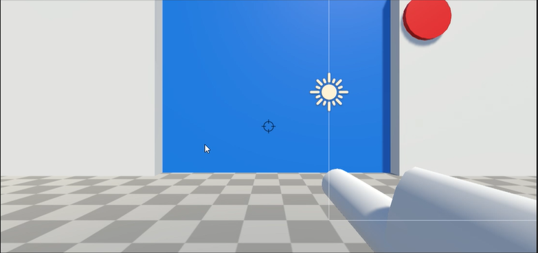
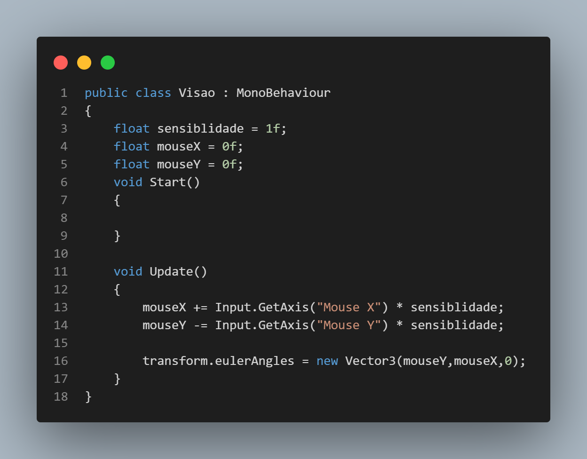
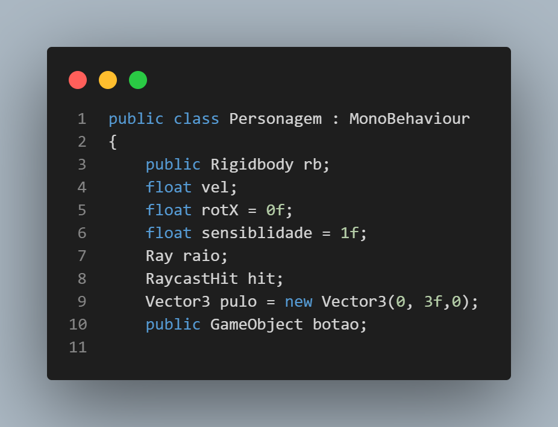
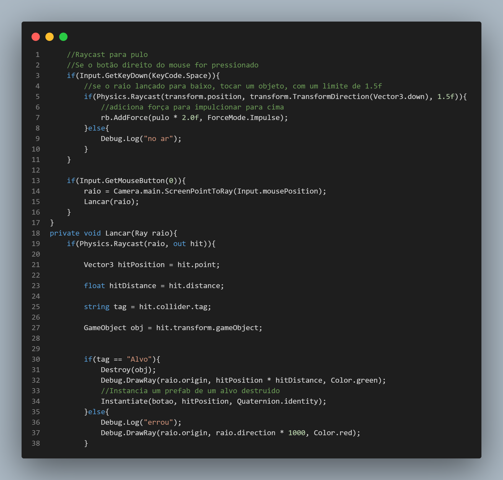

<h1 align="center">Olá 👋, somos João Lucas e Filipe Custódio</h1>
<h2 align="center">Atividade de LP - Unity Raycast</h2>

- LINK PARA O PROJETO NO DRIVE: [https://drive.google.com/drive/folders/1P460PHkBUXLBYklIy_QJibNZia2AmqxJ?usp=sharing](https://drive.google.com/drive/folders/1P460PHkBUXLBYklIy_QJibNZia2AmqxJ?usp=sharing)

<h2>Ferramentas Utilizadas:</h2> 

   

<h2>Andamento do projeto:</h2> 
Concluído

<h2>Descrição do Projeto:<h2>
Projeto se trata sobre a elaboração de uma cena teste no Unity, que aplique os conceitos de Raycast, Prefabs e Destroy dentro da game Engine

<h1>Explicação dos Scripts:</h1>
<h1>visao.cs</h1>

 
Este script faz com que o jogador controle a rotação da câmera usando o mouse, proporcionando uma experiência de visualização mais interativa. Descrição das linhas do código a seguir:

 
 

 - Temos uma declaração de variáveis no início do código, que tem o objetivo de determinar a velocidade com que a câmera irá girar em resposta ao movimento do mouse.
 
 - mouseX += Input.GetAxis("Mouse X") * sensibilidade: é atualizada a variável 'mouseX', adicionando a mudança na posição do mouse ao longo do eixo X, multiplicada pela sensibilidade. Isso permite que a câmera gire horizontalmente conforme movemos o mouse para a esquerda ou direita.
   
 - mouseY -= Input.GetAxis("Mouse Y") * sensibilidade: temos algo muito semelhante ao que foi proposto anteriormente, porém o sinal negativo é usado aqui para permitir que a câmera gire verticalmente conforme movemos o mouse para cima ou para baixo.

 - transform.eulerAngles = new Vector3(mouseY, mouseX, 0): pode-se notar a rotação da câmera com base nas variáveis mouseX e mouseY, isso cria um efeito de olhar livre, onde a câmera pode se mover livremente em torno do objeto alvo, mas não estamos aplicando rotação no eixo Z (0), o que significa que a câmera não irá rolar para fora da cena.

<h1>personagem.cs</h1>

 
Esta parte do script é responsável por declarar variáveis, armazenando informações como o Rigidbody do personagem, a velocidade de movimento, a sensibilidade do mouse, o raio para o Raycast e o objeto a ser instanciado quando um alvo é destruído.

 
Ainda no mesmo falando sobre a outra parte do mesmo script, pode-se falar sobre: 

- if(Input.GetKeyDown(KeyCode.Space)) faz com que o código seja executado quando a tecla de espaço é pressionada.

- if(Physics.Raycast(transform.position, transform.TransformDirection(Vector3.down), 1.5f)) faz lançar um raio para baixo a partir da posição do personagem, se esse raio atingir algum objeto a uma distância máxima de 1.5 unidades será igual a verdadeira.

- rb.AddForce(pulo * 2.0f, ForceMode.Impulse) Se o raio atingir um objeto, é adicionado uma força de pulo ao Rigidbody (rb) do personagem.
  
- if(Input.GetMouseButton(0)) Esse código será executado quando o botão esquerdo do mouse é pressionado.

- raio = Camera.main.ScreenPointToRay(Input.mousePosition): Aqui, criamos um raio que vai da câmera até a posição atual do mouse na tela.

- Lancar(raio): Chamamos a função Lancar passando o raio como argumento.

- private void Lancar(Ray raio) faz com que receba um raio como entrada e é responsável por lidar com o Raycast para detectar e destruir alvos.

- if(Physics.Raycast(raio, out hit)): faz lançar um raio a partir da posição e direção fornecidas pelo raio, se o raio atingir um objeto, a função retorna verdadeiro e armazena informações sobre o objeto atingido na variável hit.

- string tag = hit.collider.tag faz obter a tag do colisor do objeto atingido.

- if(tag == "Alvo") Se o objeto atingido tiver a tag "Alvo", isso significa que é um alvo que deve ser destruído.

- Destroy(obj): Destruímos o objeto atingido.

- Instantiate(botao, hitPosition, Quaternion.identity) Intância, chama um novo GameObject a partir do prefab botao na posição do alvo destruído.

  

